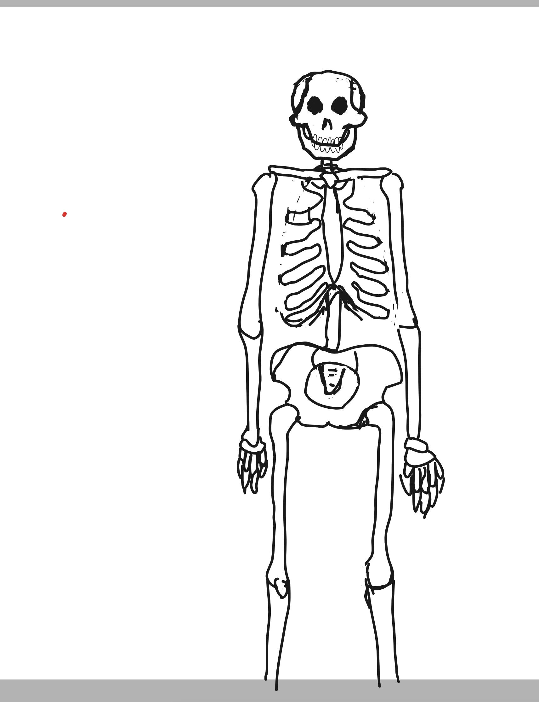
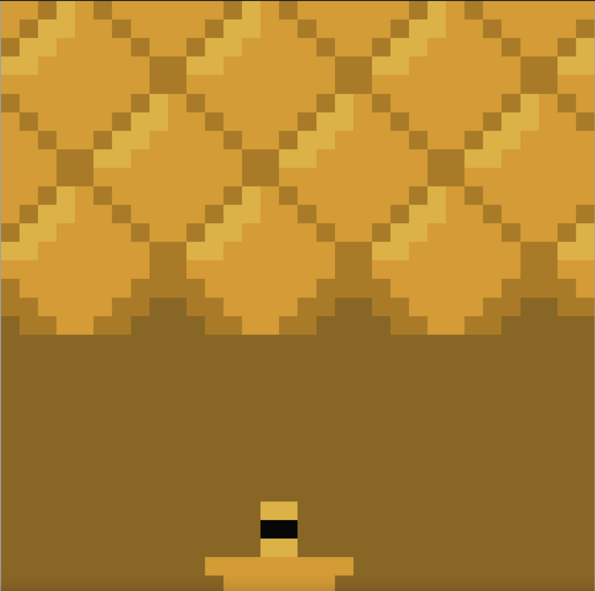

# Project-3A-Proposal 1: Bonle
  For this project we are looking at making a game similar to the wordle knock-off "globle game", but instead of the countries on earth its bones in the human body. This game is 3d and will be made using the game engine Unity. The game is singleplayer with different difficulties the user gets to choose from. The aim of the game is to guess a random target bone out of a selection of bones(specific to difficulty) by looking at the rest of the bones. When you guess a wrong bone, it will light up a color from white to red, with the closest bones being more red and the farthest being more white.

## GUI Mockup #1: Title Page

## GUI Mockup #2:Gameplay

## GUI Mockup #3:Game Over

## Class Diagram #1

# Project-3A-Proposal 2: Honeycomb Breakout
  This idea is pretty simple, its like the traditional game breakout, but the blocks are hexagons so that they fit snuggly. Each level there will be different paths
  made out of hexagons that the player will use to finish the level.

## GUI Mockup #1: Title

## GUI Mockup #2: Gameplay

## GUI Mockup #3: Game Over

## Class Diagram #1

