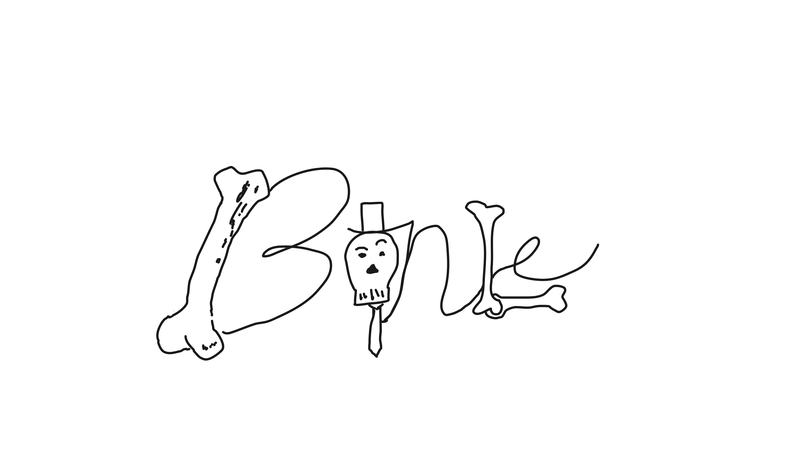
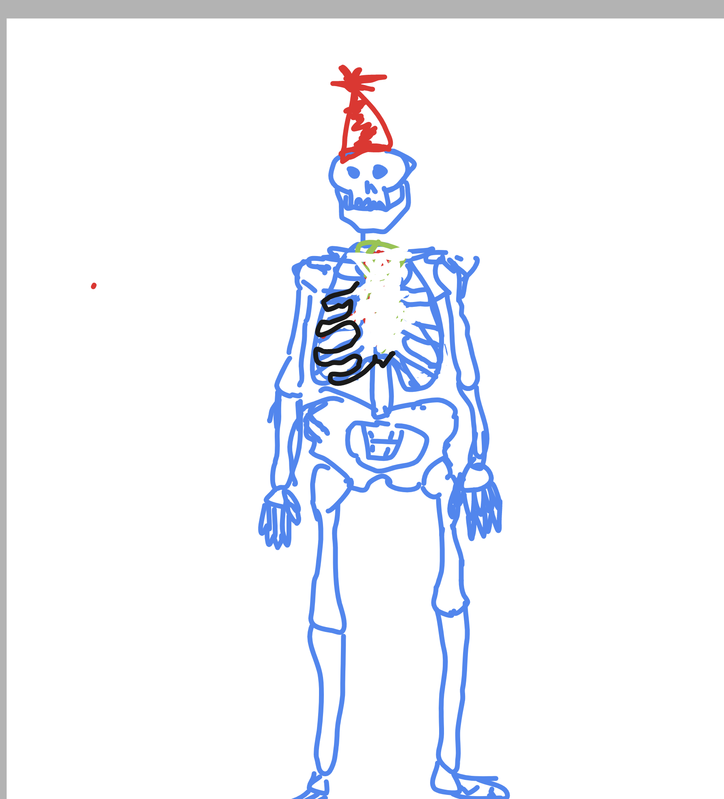
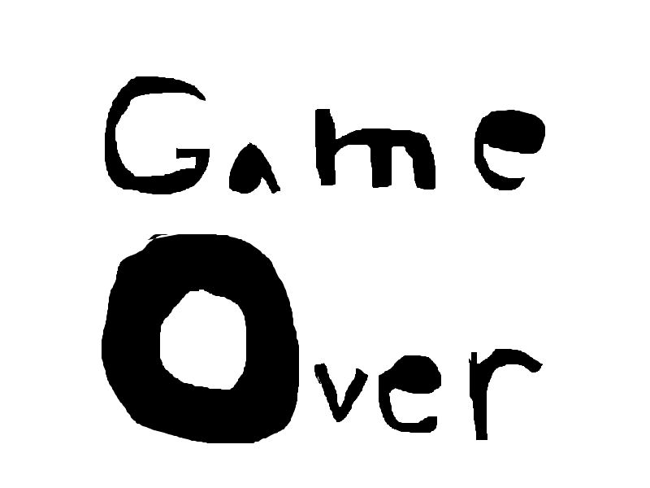
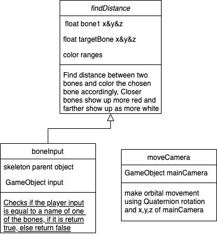
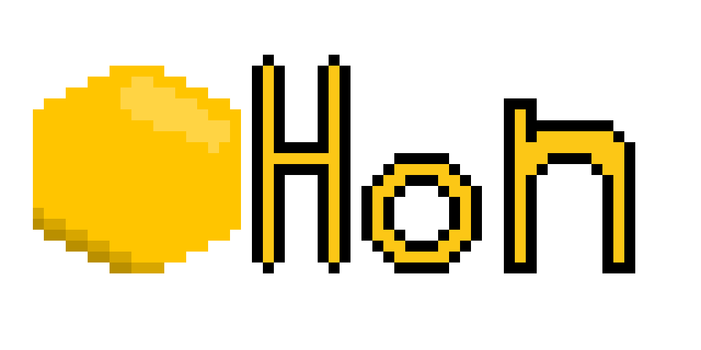
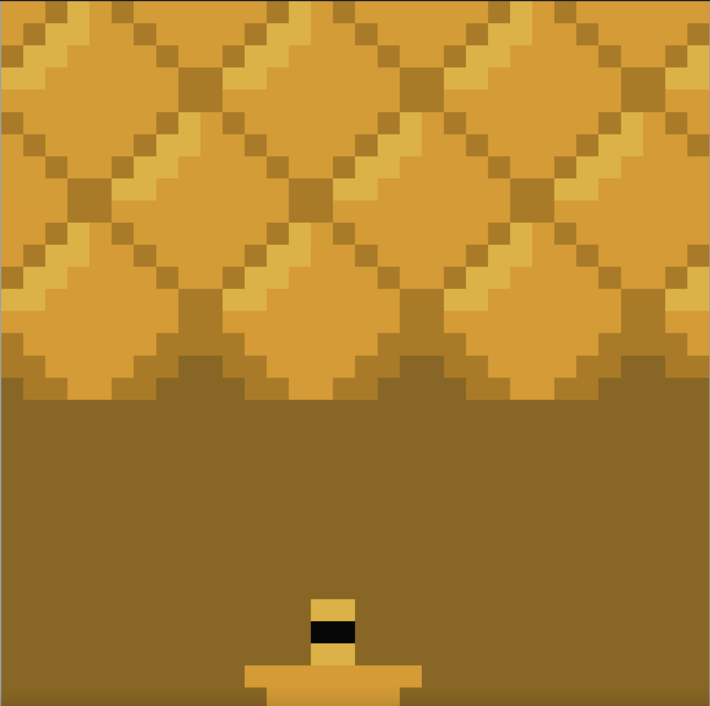
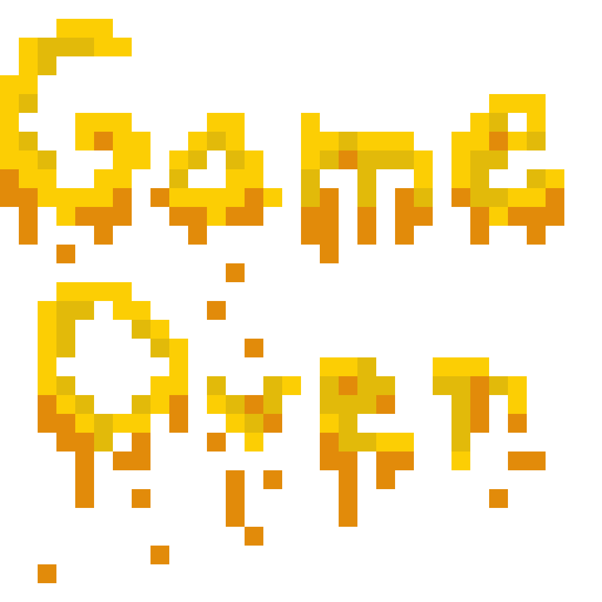

# Project-3A-Proposal 1: Bonle
  For this project we are looking at making a game similar to the wordle knock-off "globle game", but instead of the countries on earth its bones in the human body.
  You will be able to guess different bones and they will light up based on how close they are to the target bone

## GUI Mockup #1: Title Page

## GUI Mockup #2:Gameplay

## GUI Mockup #3:Game Over

## Class Diagram #1

# Project-3A-Proposal 2: Honeycomb Breakout
  This idea is pretty simple, its like the traditional game breakout, but the blocks are hexagons so that they fit snuggly. Each level there will be different paths
  made out of hexagons that the player will use to finish the level.

## GUI Mockup #1: Title

## GUI Mockup #2: Gameplay

## GUI Mockup #3: Game Over

## Class Diagram #1
(sawyer or isabelle decide if you want)
